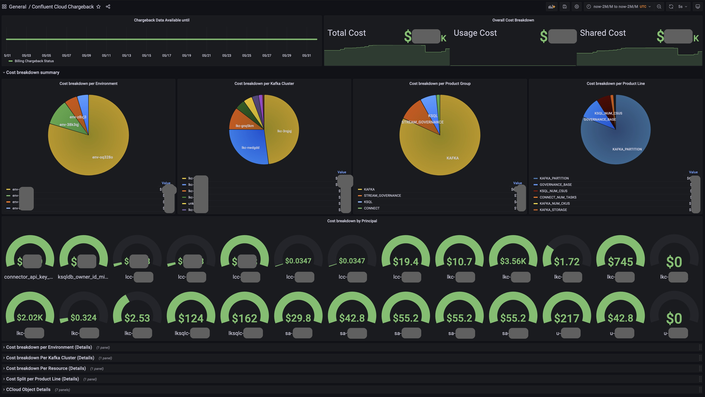

# Confluent Cloud Chargeback Helper/Calculator

Confluent Cloud has a lot of objects and a very detailed API model. There are 2 core API's available with Confluent
Cloud:

1. [Confluent Cloud Core Objects API](https://docs.confluent.io/cloud/current/api.html) : This API provides the details of current objects present in the Confluent ecosystem.
2. [Confluent Cloud Metrics API](https://api.telemetry.confluent.cloud/docs/descriptors/datasets/cloud) : This API provides us with the plethora of Metrics available from various systems in Confluent Cloud.

The billing data is also available out of the box with Confluent Cloud API and is pretty detailed by itself. So what does this code do in that case? This codebase aggregates data from the various API endpoints that are available with Confluent Cloud, co-relates them and produces meaningful detailed datasets.

The Billing API data only has data which is granular upto 1 day at a time. These datasets are divided into per hour chunks by this code, co-related to data for same interval from Metrics API (indirectly - more on that in sometime). This co-related data is identified to the the matching Objects (Service Accounts, users, API Keys, kafka Clusters etc) and a enriched dataset is generated.

This enriched dataset is hosted as Open Metrics compatible format via an endpoint so that systems that can feed off the that format can scrape the data from there. The code senses that a scrape has been performed and refreshes the exposed data for the next hour. It exposes data on a per hour basis to ensure optimized scrape.

Eventually the data looks something like this in Grafana Dashboard:



Before getting into more details about the architecture, let's go through a quickstart first.

## Quickstart

### Pre-requisites

1. Ensure that you have a Prometheus Instance that is already gathering Metrics API dataset. This will be needed later while configuring the chargeback handler.

2. Create a new Service Account. We will be using this account to create an API Key which will be used in the Chargeback handler.

   ```
   confluent login
   confluent iam sa create chargeback_handler --description "Chargeback handler user."
   ```

   This will provide you with the Service Account ID which has the format `sa-*******`. Note this ID as you will need it for the next set of commands.

3. Assign this Service account the permissions below

   ```
   confluent iam rbac role-binding create --principal User:<sa_id_generated_above>  --role MetricsViewer
   confluent iam rbac role-binding create --principal User:<sa_id_generated_above>  --role BillingAdmin
   ```

   MetricsViewer permission is required for this account to be able to pull the Objects API as well as the Metrics API data.
   BillingAdmin permission is required for this account to be able to pull the Billing API data.

4. Create an API Key associated with this account
   ```
   confluent api-key create --resource cloud --service-account <sa_id_generated_above>
   ```

### Chargeback Handler Configuration

1. Clone the chargeback repo.

   ```
   git clone https://github.com/waliaabhishek/ccloud-chargeback-helper.git
   ```

2. Open the repo in your preferred Code editor as we'll need add some properties. I will be using vscode as that is my preferred Code Editor

   ```
   code ccloud-chargeback-helper
   ```

3. Open the file called .my-env in the root folder and change all the necessary values.

   > **`Note`**
   > If you dont have a Metrics API server, Copy Paste the URL from CHARGEBACK_SERVER_URL variable and change the METRICS_API_SERVER_ENABLE_AUTH value to `False`. Auth values dont matter if this switch is turned off.

   > **`Warning`**
   > If you used the Chargeback Server URL for the Metrics API server, the code will function but will be approximate and may assign cost to non Service Account/ User Account entities. This is because the Metrics API data is necessary to compute certain types of chargebacks. If it not available, the code turns into a best effort path for calculating chargebacks instead of dropping those values.

4. Open a terminal window and go the directory where the codebase is checked out.
5. Run the following command

   ```
   docker compose  --env-file .my-env up -d --remove-orphans
   ```

   > **`Note`**
   > If you are an advanced user who needs docker-copose Overrides as well; the following command will work

   ```
   docker compose  --env-file .my-env -f docker-compose.yml  -f docker-compose.local.yml up -d --remove-orphans
   ```

6. The chargeback code should be now running.

7. These are the following details that you should know

   1. Grafana URL: `http://localhost:3000`
   2. Grafana Username `admin`
   3. Grafana Password `password`
   4. Chargeback Prometheus URL `http://localhost:9091` (No user/pass required)

8. Enjoy!

# Architecture

Details coming soon !!
