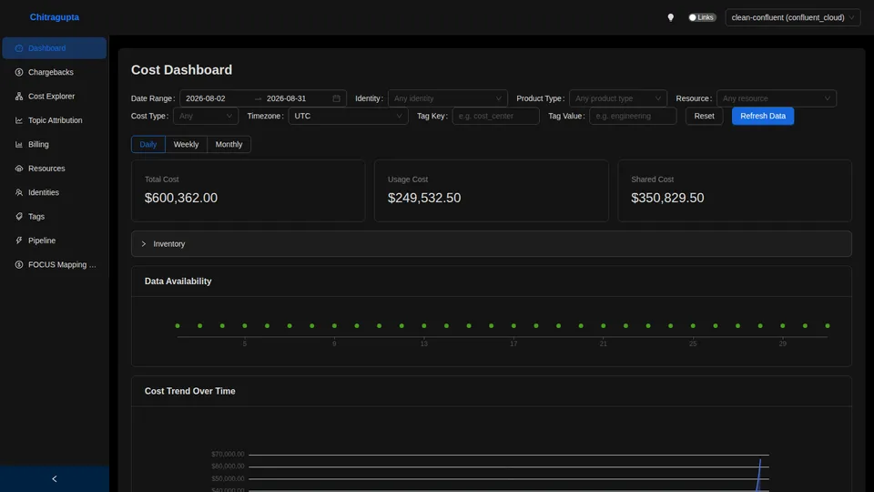

# Chitragupta (formerly ccloud-chargeback-helper)

[](https://github.com/waliaabhishek/chitragupta/actions/workflows/ci.yml)
[](https://codecov.io/gh/waliaabhishek/chitragupta)
[](https://www.python.org/downloads/)
[](https://github.com/astral-sh/ruff)
[](https://mypy-lang.org/)
[](https://github.com/astral-sh/uv)

> In Hindu tradition, [Chitragupta](https://en.wikipedia.org/wiki/Chitragupta) is the deity who maintains a complete record of every being's actions; the divine accountant himself. Fitting name for a system that tracks exactly who used what and how much it cost.

Multi-ecosystem infrastructure cost chargeback engine. Allocates costs to teams and service accounts across Confluent Cloud, self-managed Kafka, and any Prometheus-instrumented system.
The goal is to support multiple ecosystems and custom cost allocation strategies. 
This was originally built for Confluent Cloud but has been extended to support other ecosystems. 

> [!IMPORTANT] 
> The v2 version is a complete rewrite from ground up for a full plugin architecture, multi-tenancy, FastAPI, proper storage layer with mitigations, emitter framework, docs site. 
> Essentially an entirely new system with a lot more features and a much better performance profile. 
> The goal is to keep adding more features and improvements as I go along and as more requests come in.

## New Features

- 4x-10x faster performance for chargeback calculations and persistence compared to V1.
- Custom Tags support to allow ease of filters and chargeback grouping/aggregation.
- Full documentation website for ease of use.
- Pulls billing data from APIs or YAML cost models
- Discovers resources and identities using plugin specific implementations. 
- Allocation strategies are now pluggable and can be customized for each SKU type.
- Evolving REST API for querying chargeback data and triggering pipeline runs.
- New UI (still in progress) that does need Grafana or external viewers.
- Multi emitter support for different output formats and more coming as needed/requested in the future.
- Topic attribution overlay — breaks Kafka cluster costs down to individual topics using Prometheus metrics (CCloud-only, requires a configured metrics source).
- Nascent support for Self Managed Kafka styled cost models.

## Breaking Changes from V1

- Config YAML format has changed substantially to support multiple ecosystems and custom cost allocation strategies.
- Plugin based architecture for adding new ecosystems, cost allocation strategies, emitters and more.
- Code now has internal persistence layer using SQLite(default) instead of in-memory cache.
- Prometheus metrics have been removed in favor of a database-backed retention.
- Grafana directly queries the database instead of Prometheus. No prometheus instance or script to write are needed anymore, yay!


## Supported Ecosystems

| Ecosystem | Plugin | Billing Source |
|-----------|--------|----------------|
| Confluent Cloud | `confluent_cloud` | CCloud Billing API |
| Self-managed Kafka | `self_managed_kafka` | YAML cost model + Prometheus |
| Generic metrics | `generic_metrics_only` | YAML cost model + Prometheus |

## Quick Start

For a credential-free synthetic stack, see the [Demo guide](docs/getting-started/demo.md)
and run `./demo` from the repository root. It covers Clean and Showcase
profiles, optional Grafana, LAN exposure, port overrides, lifecycle commands,
and raw Compose escape hatches.

### Demo media



The [Demo media release](https://github.com/waliaabhishek/chitragupta/releases/tag/demo-media)
contains stable screenshots and a walkthrough generated from synthetic data. The
[Demo guide](docs/getting-started/demo.md#demo-media) explains how to capture,
review, and publish the bundle.

```bash
git clone https://github.com/waliaabhishek/chitragupta.git
cd chitragupta/examples/ccloud-full

# Fill in your CCloud API credentials
cp .env.example .env
vim .env

# Start the full stack (API + Grafana + UI)
docker compose up -d
```

- API: http://localhost:8080
- Grafana dashboards: http://localhost:3000 (admin / password)
- Frontend UI: http://localhost:8081

The [Quickstart guide](docs/getting-started/quickstart.md) covers everything end-to-end: service account creation, permissions, API key setup, and running with Docker Compose. Three self-contained examples are available in [`examples/`](examples/) — see `ccloud-grafana/`, `ccloud-full/`, or `self-managed-full/`.

## Architecture

```
AppSettings → WorkflowRunner → ChargebackOrchestrator
                                  ├── EcosystemPlugin
                                  │     ├── ServiceHandler×N → CostAllocator
                                  │     ├── CostInput
                                  │     └── MetricsSource
                                  ├── StorageBackend
                                  └── Emitter×N
```

Each tenant maps to one ecosystem plugin. The orchestrator runs a per-tenant, per-date pipeline: gather resources → resolve identities → fetch costs → allocate → store → emit. An optional **topic attribution** overlay stage (CCloud + Prometheus only) runs after chargeback calculation to attribute Kafka cluster costs to individual topics.

## Documentation

Full documentation is available [here](https://waliaabhishek.github.io/chitragupta/latest/).

## Development

```bash
# Install with dev dependencies
uv sync --group dev

# Run tests
uv run pytest

# Lint and type check
uv run ruff check
uv run mypy src
```

## Requirements

- Python 3.14+
- [uv](https://docs.astral.sh/uv/) package manager
